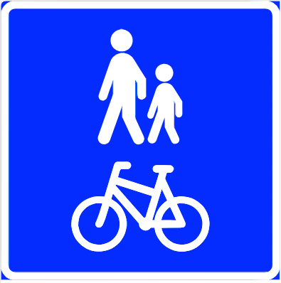

# statsbudsjett_fylkesveg2025

Vi viser til regjeringsdokumentet 
[Forslag til ny modell for beregning av kriteriet for fylkesveg i inntektssystemet for fylkeskommunene](https://www.regjeringen.no/no/dokumenter/forslag-til-ny-modell-for-beregning-av-kriteriet-for-fylkesveg-i-inntektssystemet-for-fylkeskommunene/id2864850/), som igjen viser til [denne rapporten](https://www.regjeringen.no/contentassets/e8645ebe0e02470da89253caef0addba/rapport-forenklet-modell-til-kriteriet-for-utgiftsbehov-ti1405835.pdf). Denne rapporten, skrevet av konsulentselskapet Vianova, har detaljerte instruksjoner for hvilke data som inngår i inntektsmodellen, samt detaljerte instruksjoner for nedlasting og databearbeiding. Disse instruksjonene er her omsatt til python-kode for automatisert, repeterbar og etterprøvbar fremstiling. Rapporten er også 
[lagret lokalt](./pics/rapport-forenklet-modell-til-kriteriet-for-utgiftsbehov-ti1405835.pdf)

### Revisjon 2024 

Etter dialog med samferdselsdepartementet våren 2024 fikk Statens vegvesen tildelingsbrev med beskjed om et par justering av metodikk for datauttak: 
  * Feltlengde skal ikke lengre tas ut for bilferje, kun for kjørbar bilveg
  * Lengde _Gang- og sykkelveg_ suppleres med data for veglenketypene _gangveg_ og _sykkelveg_.

### Feltlengde

Feltlengde regnes ut ved å multiplisere antall kjørefelt med lengden på vegnettet og summere per fylke. En viktig endring er at for budsjettåret 2025 så skal vi ikke lenger teller feltlengde for veglenketypen _bilferje_. Vi teller heller ikke med konnekteringslenker. Det betyr at vi regner ut feltlengde for veglenketypene Enkel bilveg, Rampe, Kanalisert veg, Rundkjøring og Gatetun. 

Endringene for budsjettåret 2025 ser ut til å være konsistente med frafall av bilferjer, samt  naturlig variasjon (vegutbygging, omklassifisering av veger, samt øvrig dataajourhold).

### Lengde Undersjøiske og Ikke-undersjøiske tunneller  

Vi summerer lengden registrert på NVDB objekttype 581 Tunnel. Aller helst bruker vi egenskapen _"Sum lengde alle løp"_, men for 20 av tunnelobjektene mangler vi denne egenskapverdien, og for dem bruker vi i stedet egenskapen _"Lengde offisiell"_. 

Sju av tunnellene er for gående og syklende (trafikantgruppe G), og telles ikke med. Ved senere revisjon bør vi diskutere om vi også skal inkludere tunneller for syklende og gående. 

Siden i fjor er det kommet til tre nye tunneller: 
  * Rogaland: Byhaugtunnelen (777 meter) har byttet vegkategori, fra europaveg til fylkesveg 
  * Møre og Romsdal: Indreeidstunellen (4892 meter)
  * Troms: Svartholla II (99 meter) 

I tillegg var det en tunnel i Vestland fylke der det en periode i 2023 var en registreringsfeil som medførte at Agjeldstunnelen (961 meter)  ble regnet som undersjøisk tunnel da vi tok ut inntektsgrunnlag sommeren 2023. Datafeilen ble korrigert i NVDB senere samme år, mer presist har egenskapen  `Undersjøisk = Ja` blitt korrigert til verdien  `Nei`. Dette er årsaken til at Vestland fylke for inntektsgrunnlag 2025 har 961 meter mindre undersjøisk og 961 meter mere ikke-undersjøisk tunnel enn i fjor.

### Trafikkarbeid (millioner kjøretøykm)

Trafikkarbeid er regnet ut som millioner kjøretøykm per dag - ikke per år, slik man ofte ellers finner i litteratur. Utregningen er helt enkelt at man for hver bit av vegnettet multipliserer lengden med ÅDT-verdien for denne vegbiten, summerer per fylke og deler på én million. 

Sammenlignet med i fjor har vi kun kosmetiske variasjoner på 0.3% eller lavere. 

### Lengde veg med ÅDT over 4000 kjøretøy per døgn

Dette er summen av lengde vegnett med årsdøgntrafikk (ÅDT) større enn 4000 kjøretøgn per døgn. Her observerer en nedgang for 10 av 14 fylker, og det virker jo ikke helt naturlig. 

For meg ser det ut som om ÅDT-tallene ofte, men ikke alltid, blir rundet av til "passe store tall", for eksempel nærmeste 100, 250, 500 eller 1000. Jeg er temmelig sikker på at denne avrundingen er solid innafor usikkerhetsmarginen til ÅDT-estimatet. Jeg har ikke undersøkt dette nærmere, men vil tippe at det er en faglig begrunnelse i brukervennlighet: A) det er lettere å skjønne fordelingen av trafikkmengde når ÅDT-tallene er avrundet, B) avrundingen formidler bedre den iboende usikkerheten i ÅDT-estimatet. 

Det subjektive inntrykket er at ÅDT-verdiene for noen vegstrekninger er justert fra litt over 4000 til eksakt 4000, og dermed ikke lenger regnes med i inntektsgrunnlaget. For eksempel Fv416 like vest for Risør hadde i fjor ÅDT-verdien 4300, mens den i år er eksakt lik 4000. Dette har skjedd for tilstrekkelig mange  vegstrekninger til at årets tall er lavere enn i fjor enn i år. I fjor hadde vi 134km med ÅDT-verdi eksakt lik 4000 kjøretøy per døgn, i år er det 324km. 

Gitt at ÅDT-tallene ofte er avrundet til "passe store" tall så bør vi vurdere om _større enn eller lik 4000_ (operator `>=` ) hadde vært bedre for våre formål. 

### Lengde rekkverk (løpemeter)

Løpementer rekkverk får vi ved å summere egenskapen _Lengde_ for objekttypen rekkverk. For de objektene der denne egenskapen mangler så summerer vi i stedet lengden på det vegnettet som rekkverket er knyttet til (stedfestet på). Kun små variasjoner, største endring er i Agder fylke med 2% økning. 

### Lyspunkt i dagen 

Belysningspunkt i dagen er en opptelling av objekttypen "Belysningspunkt" på kjørbar fylkesveg (trafikantgruppe = K) der vi har denne kombinasjonen av egenskaper: 

  * Egenskapen Bruksområde er en av: 
    * Belysning bru
    * Belysning ferjeleie
    * Belysning gangfelt
    * Belysning område/plass
    * Belysning skilt
    * Belysning veg/gate
    * Belysning vegkryss
    * (tom)
  * Egenskapen Eier er en av
    * Fylkeskommune
    * Stat, Statens vegvesen
    * (tom)

Her er det ganske stor variasjon: Finnmark har nesten 8% færre og Agder har 42% flere lyspunkt enn i fjor. Jeg har ikke studert detaljene her, men ønsker å påpeke at denne parameteren er svært sårbart for riktig registrering av egenskapsverdiene som inngår i filtreringen. Dataajourhold vil dermed ha stor påvirkning. 

### Lengde bruer av stål og bruer av andre materialtyper enn stål 

Dette er summen av egenskapen _Lengde_ for objekttype bru på kjørbar fylkesveg med disse egenskapverdiene
  * Brukategori =  _Bru i fylling_ eller _vegbru_ 
  * Status = _Trafikkert_ eller tom (blank)
  * Materialtype = _Stål_ summeres som _Lengde bruer av stål_, alle andre materialtyper summeres som _Lengde bruer av andre materialtyper enn stål_. 

### Ferjekaibru og tillegskai

Disse dataene ajourholdes i Brutus, som også fortløpende oppdaterer objekttypen "60 Bru" i NVDB. Her følger vi den såkalte  [Vianova-oppskriften fra 2021](https://www.regjeringen.no/contentassets/e8645ebe0e02470da89253caef0addba/rapport-forenklet-modell-til-kriteriet-for-utgiftsbehov-ti1405835.pdf)

som beskriver filtre for datauttak av NVDB-objekt av typen 60 bru på fylkesveg:
  * vegsystemreferanse = Fv
  * trafikantgruppe = 'K'

Og filtrert på disse egenskapene:
  * Brukategori = Ferjeleie 
  * Status = Trafikkert, (blank) 
  * Byggverkstype skal være én av disse: 
    * Ferjekaibru (810)
    * Ferjekaibru (811)
    * Ferjekaibru (812)
    * Kai (820)
    * Tilleggskai (822)
    * Tilleggskai (823)
    * Tilleggskai (824)

Merk at egenskapsfilteret `Byggverkstype' dermed også ekskluderer  variantene: 
  * Tilleggskai (821)
  * Ferjekaibru (819)
  * Liggekai (826)
  * Liggekai (827) 
  * Ro-Ro-rampe (828)

Vi er ikke kjent med det faglige grunnlaget for at Vianova-oppskriften eksluderer disse fem byggverkstypene, og mener dette burde vært revidert. 

For datauttaket til statsbudsjett 2025 ser vi at vi har en reduksjon på 8 stykk ferjekaibru og tilleggskai i forhold til i fjor. Vi har tatt stikkprøver for fem av dem: Ett objekt [392903643](http://vegkart.atlas.vegvesen.no/#valgt:392903643:60) ligger på vegnett som er satt historisk pga fysisk ombygging. De fire andre har fått egenskapverdien `Byggverkstype = Ferjekaibru (819)`, som IKKE skal regnes med når vi følger Vianova-oppskriften slavisk. 

# Lengde gangveg, sykkelveg og gang- og sykkelveg

Tidligere har vi kun talt opp veglenketypen _Gang og sykkelveg_.  Fra og med i år skal vi også telle med veglenketypene _Gangveg_ og _Sykkelveg_. Dette er nye veglenketyper som vi tidligere har manglet data på, men som nå gradvis blir registrert i NVDB. 

Tallene for foregående års inntekstgrunnlag er derfor ikke direkte sammenlignbare, ettersom de kun talte _Gang og sykkelveg_. I tillegg jobber både Kartverket og Statens vegvesen med å få registrert manglende data på disse veglenketypene, så årets data er ikke nødvendigvis komplette.  

### Veg med fartsgrense 50 km/t eller lavere

Her følger vi KOSTRA-metodikk for å telle veg: _Vi teller alle kryssdeler, men ikke sideanlegg, konnekteringslenker eller adskilte løp=MOT. Og vi teller kun veglenketypene kanalisertVeg, enkelBilveg, rampe, rundkjøring og gatetun_. 